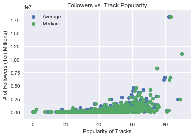
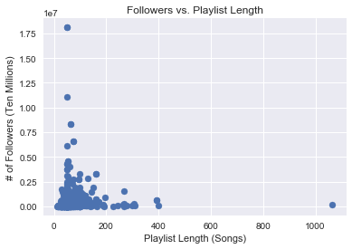
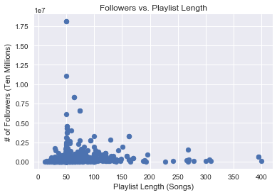
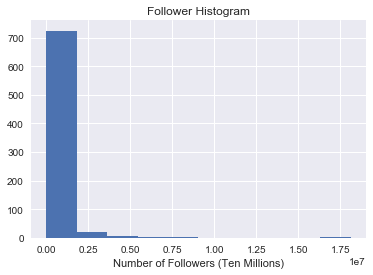
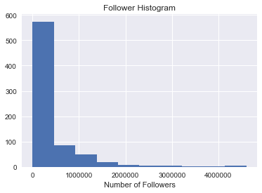
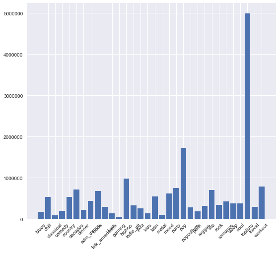

## Contents
{:.no_toc}
*  
{: toc}

## Preliminary EDA


### Data

First, we load in the data called from the Spotify API. This contains 668 unique playlists, featured in Spotify's playlist categories. 


```python
playlists = pd.read_csv('clean_playlists.csv')
playlists.head()
```


<div>
<style>
    .dataframe thead tr:only-child th {
        text-align: right;
    }

    .dataframe thead th {
        text-align: left;
    }

    .dataframe tbody tr th {
        vertical-align: top;
    }
</style>
<table border="1" class="dataframe">
  <thead>
    <tr style="text-align: right;">
      <th></th>
      <th>Unnamed: 0</th>
      <th>index</th>
      <th>collaborative</th>
      <th>external_urls</th>
      <th>href</th>
      <th>id</th>
      <th>images</th>
      <th>name</th>
      <th>owner</th>
      <th>public</th>
      <th>snapshot_id</th>
      <th>tracks</th>
      <th>type</th>
      <th>uri</th>
      <th>Category</th>
      <th>followers</th>
      <th>length</th>
      <th>avgpopularity</th>
      <th>medianpopularity</th>
    </tr>
  </thead>
  <tbody>
    <tr>
      <th>0</th>
      <td>0</td>
      <td>0</td>
      <td>False</td>
      <td>{'spotify': 'https://open.spotify.com/user/spo...</td>
      <td>https://api.spotify.com/v1/users/spotify/playl...</td>
      <td>37i9dQZF1DXcBWIGoYBM5M</td>
      <td>[{'height': 300, 'url': 'https://i.scdn.co/ima...</td>
      <td>Today's Top Hits</td>
      <td>spotify</td>
      <td>NaN</td>
      <td>tPFeuJGfnNwJ5jo+rmXv7rrfqbrNcxUHR5MQHA3blrrUKy...</td>
      <td>{'href': 'https://api.spotify.com/v1/users/spo...</td>
      <td>playlist</td>
      <td>spotify:user:spotify:playlist:37i9dQZF1DXcBWIG...</td>
      <td>toplists</td>
      <td>18116060</td>
      <td>50</td>
      <td>82.200000</td>
      <td>83.5</td>
    </tr>
    <tr>
      <th>1</th>
      <td>1</td>
      <td>1</td>
      <td>False</td>
      <td>{'spotify': 'https://open.spotify.com/user/spo...</td>
      <td>https://api.spotify.com/v1/users/spotify/playl...</td>
      <td>37i9dQZF1DX0XUsuxWHRQd</td>
      <td>[{'height': 300, 'url': 'https://i.scdn.co/ima...</td>
      <td>RapCaviar</td>
      <td>spotify</td>
      <td>NaN</td>
      <td>Q6cEpY6aPFcl9GxOVxCIUHWUqhN8kKEpAjg5MZ9X0LYRLd...</td>
      <td>{'href': 'https://api.spotify.com/v1/users/spo...</td>
      <td>playlist</td>
      <td>spotify:user:spotify:playlist:37i9dQZF1DX0XUsu...</td>
      <td>toplists</td>
      <td>8310878</td>
      <td>64</td>
      <td>75.215686</td>
      <td>75.0</td>
    </tr>
    <tr>
      <th>2</th>
      <td>2</td>
      <td>2</td>
      <td>False</td>
      <td>{'spotify': 'https://open.spotify.com/user/spo...</td>
      <td>https://api.spotify.com/v1/users/spotify/playl...</td>
      <td>37i9dQZF1DX4dyzvuaRJ0n</td>
      <td>[{'height': 300, 'url': 'https://i.scdn.co/ima...</td>
      <td>mint</td>
      <td>spotify</td>
      <td>NaN</td>
      <td>oHu+fIsYVLYH9GxatW6nRL5+dROy3uHgj0ZLTeRhOv9nbg...</td>
      <td>{'href': 'https://api.spotify.com/v1/users/spo...</td>
      <td>playlist</td>
      <td>spotify:user:spotify:playlist:37i9dQZF1DX4dyzv...</td>
      <td>toplists</td>
      <td>4598719</td>
      <td>52</td>
      <td>60.640000</td>
      <td>62.5</td>
    </tr>
    <tr>
      <th>3</th>
      <td>3</td>
      <td>3</td>
      <td>False</td>
      <td>{'spotify': 'https://open.spotify.com/user/spo...</td>
      <td>https://api.spotify.com/v1/users/spotify/playl...</td>
      <td>37i9dQZF1DXcF6B6QPhFDv</td>
      <td>[{'height': 300, 'url': 'https://i.scdn.co/ima...</td>
      <td>Rock This</td>
      <td>spotify</td>
      <td>NaN</td>
      <td>HQtUfPf/BYcKrHPiA3iXYwFAPRIzSWyMbHPG8YPybDj2QT...</td>
      <td>{'href': 'https://api.spotify.com/v1/users/spo...</td>
      <td>playlist</td>
      <td>spotify:user:spotify:playlist:37i9dQZF1DXcF6B6...</td>
      <td>toplists</td>
      <td>3994252</td>
      <td>59</td>
      <td>60.360000</td>
      <td>61.5</td>
    </tr>
    <tr>
      <th>4</th>
      <td>4</td>
      <td>4</td>
      <td>False</td>
      <td>{'spotify': 'https://open.spotify.com/user/spo...</td>
      <td>https://api.spotify.com/v1/users/spotify/playl...</td>
      <td>37i9dQZF1DX4SBhb3fqCJd</td>
      <td>[{'height': 300, 'url': 'https://i.scdn.co/ima...</td>
      <td>Are &amp; Be</td>
      <td>spotify</td>
      <td>NaN</td>
      <td>RyoW0COZCOPpWIJPe4Nb7Ykh95hiILTFBPidcDp3uF2VCO...</td>
      <td>{'href': 'https://api.spotify.com/v1/users/spo...</td>
      <td>playlist</td>
      <td>spotify:user:spotify:playlist:37i9dQZF1DX4SBhb...</td>
      <td>toplists</td>
      <td>3781973</td>
      <td>51</td>
      <td>64.000000</td>
      <td>65.0</td>
    </tr>
  </tbody>
</table>
</div>


### Popularity

Intuitively, one of the main factors that might impact a playlist's success is the popularity of its tracks. Here, we compare the average and median track popularity for a playlist to its followers. We do see a positive correlation. the shape of the distribution is slightly skewed given a number of outliers, which represent top-performing playlists in the "Top Lists" category. Not only are these the most followed playlists on Spotify, but their tracks are also specifically selected for their popularity.


```python
plt.scatter(playlists['avgpopularity'],playlists['followers'], label='Average')
plt.scatter(playlists['medianpopularity'],playlists['followers'], label='Median')
plt.legend(loc='best')
plt.xlabel('Popularity of Tracks')
plt.ylabel('# of Followers (Ten Millions)')
plt.title('Followers vs. Track Popularity')
plt.show()
```





### Playlist Length

Another feature of a playlist that might impact its popularity is the length of the playlist. The graph below shows that playlists tend to stay around 50 tracks, with some exceptions. There does not seem to be a clear correlation between playlist length and number of followers.


```python
plt.scatter(playlists['length'],playlists['followers'])
plt.xlabel('Playlist Length (Songs)')
plt.ylabel('# of Followers (Ten Millions)')
plt.title('Followers vs. Playlist Length')
plt.show()
```





The graph below eliminates outliers for a clearer look at the relationship between followers and playlist length, but there still is not a clear relationship to be seen.


```python
dffilter = playlists.query('length<500')
plt.scatter(dffilter['length'],dffilter['followers'])
plt.xlabel('Playlist Length (Songs)')
plt.ylabel('# of Followers (Ten Millions)')
plt.title('Followers vs. Playlist Length')
plt.show()
```





### Distribution of Followers

We also took a look at the distribution of the number of followers across our subset of playlists. It seems that there are significant outliers in our set, which will be notable as we build our model.


```python
plt.hist(playlists['followers'])
plt.xlabel('Number of Followers (Ten Millions)')
plt.title('Follower Histogram')
plt.show()
```





```python
dffilter2 = playlists.query('followers<5000000')

plt.hist(dffilter2['followers'])
plt.xlabel('Number of Followers')
plt.title('Follower Histogram')
plt.show()
```





### Genres

Here, we take a look at playlist genres, and examine which, on average, have the most followers. The DataFrame below is sorted in ascending order of mean followers. Indeed, we see that "top lists" has by far the most followers on average; these playlists likely represent the outliers we saw in the previous graphs.


```python
g1 = playlists.groupby('Category').mean()
g1['cat'] = g1.index.values
g1 = g1.reset_index()
g1 = g1.sort_values('followers')
g1
```


<div>
<style>
    .dataframe thead tr:only-child th {
        text-align: right;
    }

    .dataframe thead th {
        text-align: left;
    }

    .dataframe tbody tr th {
        vertical-align: top;
    }
</style>
<table border="1" class="dataframe">
  <thead>
    <tr style="text-align: right;">
      <th></th>
      <th>Category</th>
      <th>Unnamed: 0</th>
      <th>index</th>
      <th>collaborative</th>
      <th>public</th>
      <th>followers</th>
      <th>length</th>
      <th>avgpopularity</th>
      <th>medianpopularity</th>
      <th>cat</th>
    </tr>
  </thead>
  <tbody>
    <tr>
      <th>11</th>
      <td>gaming</td>
      <td>705.0</td>
      <td>17.0</td>
      <td>False</td>
      <td>NaN</td>
      <td>5.052354e+04</td>
      <td>84.628571</td>
      <td>37.108061</td>
      <td>40.357143</td>
      <td>gaming</td>
    </tr>
    <tr>
      <th>2</th>
      <td>classical</td>
      <td>511.5</td>
      <td>24.5</td>
      <td>False</td>
      <td>NaN</td>
      <td>8.112770e+04</td>
      <td>69.520000</td>
      <td>28.279093</td>
      <td>27.520000</td>
      <td>classical</td>
    </tr>
    <tr>
      <th>17</th>
      <td>metal</td>
      <td>403.0</td>
      <td>19.0</td>
      <td>False</td>
      <td>NaN</td>
      <td>1.012154e+05</td>
      <td>58.589744</td>
      <td>30.954652</td>
      <td>30.974359</td>
      <td>metal</td>
    </tr>
    <tr>
      <th>15</th>
      <td>kids</td>
      <td>668.5</td>
      <td>4.5</td>
      <td>False</td>
      <td>NaN</td>
      <td>1.329427e+05</td>
      <td>52.500000</td>
      <td>38.411751</td>
      <td>40.800000</td>
      <td>kids</td>
    </tr>
    <tr>
      <th>10</th>
      <td>funk</td>
      <td>750.5</td>
      <td>7.5</td>
      <td>False</td>
      <td>NaN</td>
      <td>1.331781e+05</td>
      <td>115.375000</td>
      <td>33.291822</td>
      <td>35.562500</td>
      <td>funk</td>
    </tr>
    <tr>
      <th>0</th>
      <td>blues</td>
      <td>640.0</td>
      <td>6.0</td>
      <td>False</td>
      <td>NaN</td>
      <td>1.681978e+05</td>
      <td>45.384615</td>
      <td>32.181175</td>
      <td>36.115385</td>
      <td>blues</td>
    </tr>
    <tr>
      <th>22</th>
      <td>punk</td>
      <td>732.5</td>
      <td>9.5</td>
      <td>False</td>
      <td>NaN</td>
      <td>1.872764e+05</td>
      <td>77.350000</td>
      <td>35.466909</td>
      <td>37.750000</td>
      <td>punk</td>
    </tr>
    <tr>
      <th>3</th>
      <td>comedy</td>
      <td>759.5</td>
      <td>0.5</td>
      <td>False</td>
      <td>NaN</td>
      <td>1.936345e+05</td>
      <td>146.000000</td>
      <td>38.230000</td>
      <td>42.000000</td>
      <td>comedy</td>
    </tr>
    <tr>
      <th>6</th>
      <td>dinner</td>
      <td>280.0</td>
      <td>9.0</td>
      <td>False</td>
      <td>NaN</td>
      <td>2.184881e+05</td>
      <td>64.842105</td>
      <td>40.151760</td>
      <td>41.973684</td>
      <td>dinner</td>
    </tr>
    <tr>
      <th>14</th>
      <td>jazz</td>
      <td>473.5</td>
      <td>12.5</td>
      <td>False</td>
      <td>NaN</td>
      <td>2.487950e+05</td>
      <td>67.269231</td>
      <td>35.428485</td>
      <td>36.846154</td>
      <td>jazz</td>
    </tr>
    <tr>
      <th>21</th>
      <td>popculture</td>
      <td>373.5</td>
      <td>9.5</td>
      <td>False</td>
      <td>NaN</td>
      <td>2.822419e+05</td>
      <td>52.500000</td>
      <td>50.314542</td>
      <td>51.725000</td>
      <td>popculture</td>
    </tr>
    <tr>
      <th>9</th>
      <td>folk_americana</td>
      <td>619.0</td>
      <td>14.0</td>
      <td>False</td>
      <td>NaN</td>
      <td>2.874452e+05</td>
      <td>93.931034</td>
      <td>36.073392</td>
      <td>37.500000</td>
      <td>folk_americana</td>
    </tr>
    <tr>
      <th>30</th>
      <td>travel</td>
      <td>655.0</td>
      <td>8.0</td>
      <td>False</td>
      <td>NaN</td>
      <td>2.932486e+05</td>
      <td>60.941176</td>
      <td>46.626042</td>
      <td>50.264706</td>
      <td>travel</td>
    </tr>
    <tr>
      <th>23</th>
      <td>reggae</td>
      <td>680.5</td>
      <td>6.5</td>
      <td>False</td>
      <td>NaN</td>
      <td>3.085420e+05</td>
      <td>50.714286</td>
      <td>38.808491</td>
      <td>42.464286</td>
      <td>reggae</td>
    </tr>
    <tr>
      <th>13</th>
      <td>indie_alt</td>
      <td>331.0</td>
      <td>12.0</td>
      <td>False</td>
      <td>NaN</td>
      <td>3.285737e+05</td>
      <td>92.920000</td>
      <td>43.197040</td>
      <td>44.940000</td>
      <td>indie_alt</td>
    </tr>
    <tr>
      <th>25</th>
      <td>rock</td>
      <td>197.0</td>
      <td>13.0</td>
      <td>False</td>
      <td>NaN</td>
      <td>3.398690e+05</td>
      <td>82.333333</td>
      <td>44.357303</td>
      <td>46.537037</td>
      <td>rock</td>
    </tr>
    <tr>
      <th>28</th>
      <td>soul</td>
      <td>429.5</td>
      <td>6.5</td>
      <td>False</td>
      <td>NaN</td>
      <td>3.760923e+05</td>
      <td>60.357143</td>
      <td>43.400468</td>
      <td>44.428571</td>
      <td>soul</td>
    </tr>
    <tr>
      <th>27</th>
      <td>sleep</td>
      <td>304.0</td>
      <td>14.0</td>
      <td>False</td>
      <td>NaN</td>
      <td>3.796011e+05</td>
      <td>65.379310</td>
      <td>49.099881</td>
      <td>50.396552</td>
      <td>sleep</td>
    </tr>
    <tr>
      <th>26</th>
      <td>romance</td>
      <td>448.5</td>
      <td>11.5</td>
      <td>False</td>
      <td>NaN</td>
      <td>4.222404e+05</td>
      <td>77.083333</td>
      <td>46.038650</td>
      <td>48.979167</td>
      <td>romance</td>
    </tr>
    <tr>
      <th>7</th>
      <td>edm_dance</td>
      <td>126.0</td>
      <td>21.0</td>
      <td>False</td>
      <td>NaN</td>
      <td>4.292166e+05</td>
      <td>60.046512</td>
      <td>38.866234</td>
      <td>39.023256</td>
      <td>edm_dance</td>
    </tr>
    <tr>
      <th>1</th>
      <td>chill</td>
      <td>32.5</td>
      <td>19.5</td>
      <td>False</td>
      <td>NaN</td>
      <td>5.263513e+05</td>
      <td>86.675000</td>
      <td>46.844759</td>
      <td>48.775000</td>
      <td>chill</td>
    </tr>
    <tr>
      <th>4</th>
      <td>country</td>
      <td>595.5</td>
      <td>8.5</td>
      <td>False</td>
      <td>NaN</td>
      <td>5.365766e+05</td>
      <td>53.833333</td>
      <td>50.435388</td>
      <td>52.583333</td>
      <td>country</td>
    </tr>
    <tr>
      <th>16</th>
      <td>latin</td>
      <td>561.5</td>
      <td>24.5</td>
      <td>False</td>
      <td>NaN</td>
      <td>5.396720e+05</td>
      <td>51.960000</td>
      <td>52.817461</td>
      <td>53.540000</td>
      <td>latin</td>
    </tr>
    <tr>
      <th>18</th>
      <td>mood</td>
      <td>71.5</td>
      <td>18.5</td>
      <td>False</td>
      <td>NaN</td>
      <td>6.152472e+05</td>
      <td>73.736842</td>
      <td>47.301057</td>
      <td>49.223684</td>
      <td>mood</td>
    </tr>
    <tr>
      <th>8</th>
      <td>focus</td>
      <td>244.0</td>
      <td>8.0</td>
      <td>False</td>
      <td>NaN</td>
      <td>6.769143e+05</td>
      <td>88.176471</td>
      <td>48.128067</td>
      <td>49.529412</td>
      <td>focus</td>
    </tr>
    <tr>
      <th>24</th>
      <td>rnb</td>
      <td>353.5</td>
      <td>9.5</td>
      <td>False</td>
      <td>NaN</td>
      <td>7.046112e+05</td>
      <td>51.200000</td>
      <td>52.023620</td>
      <td>53.175000</td>
      <td>rnb</td>
    </tr>
    <tr>
      <th>5</th>
      <td>decades</td>
      <td>261.5</td>
      <td>8.5</td>
      <td>False</td>
      <td>NaN</td>
      <td>7.106347e+05</td>
      <td>75.277778</td>
      <td>49.093419</td>
      <td>52.972222</td>
      <td>decades</td>
    </tr>
    <tr>
      <th>19</th>
      <td>party</td>
      <td>175.5</td>
      <td>7.5</td>
      <td>False</td>
      <td>NaN</td>
      <td>7.482565e+05</td>
      <td>68.312500</td>
      <td>55.582315</td>
      <td>56.437500</td>
      <td>party</td>
    </tr>
    <tr>
      <th>31</th>
      <td>workout</td>
      <td>223.0</td>
      <td>12.0</td>
      <td>False</td>
      <td>NaN</td>
      <td>7.904530e+05</td>
      <td>60.960000</td>
      <td>53.821634</td>
      <td>55.560000</td>
      <td>workout</td>
    </tr>
    <tr>
      <th>12</th>
      <td>hiphop</td>
      <td>157.5</td>
      <td>9.5</td>
      <td>False</td>
      <td>NaN</td>
      <td>9.798709e+05</td>
      <td>60.750000</td>
      <td>54.796095</td>
      <td>55.700000</td>
      <td>hiphop</td>
    </tr>
    <tr>
      <th>20</th>
      <td>pop</td>
      <td>97.5</td>
      <td>6.5</td>
      <td>False</td>
      <td>NaN</td>
      <td>1.725535e+06</td>
      <td>67.857143</td>
      <td>55.858679</td>
      <td>57.321429</td>
      <td>pop</td>
    </tr>
    <tr>
      <th>29</th>
      <td>toplists</td>
      <td>6.0</td>
      <td>6.0</td>
      <td>False</td>
      <td>NaN</td>
      <td>4.993945e+06</td>
      <td>51.000000</td>
      <td>68.954719</td>
      <td>69.769231</td>
      <td>toplists</td>
    </tr>
  </tbody>
</table>
</div>


```python
fig=plt.figure(figsize=(9, 8))
plt.bar(g1.index.values,g1['followers'])
plt.xticks(g1.index.values,g1['cat'],size='medium',rotation=45)
plt.show()
```





```python

```

